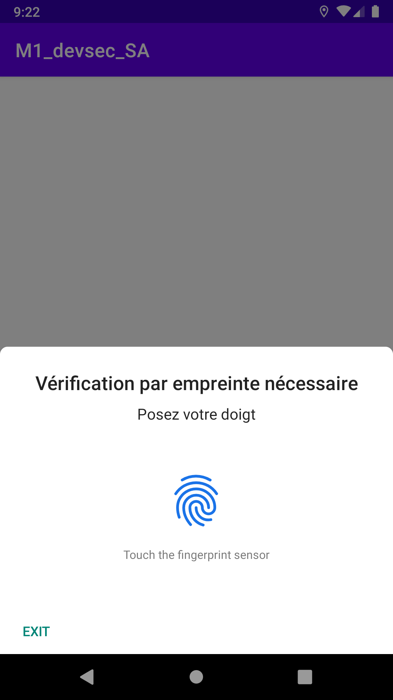

# M1 Secure Development : Mobile applications

### Our team :
 - CHAIGNE Hyacinthe
 - MARLARD Axel
 - POTAGES Pierre-Yves
 - VIVIER Louis

## How to verify user identity on opening ?
In order to verify who's launching the app we first thought of putting a password on the app, based on a schema or a random pattern based on the time and date of the year at a special opening time. The issue here is that if an attacker know the trick or the password, the protection would be void. And what is still known to be a strong security protection is with biometric authentification. Meaning only the registred fingerprint can allow an access to the app. We use biometric framework of Android to verify user identity on opening.

## How to securely store data on the phone ?
We were asked to allow the user to open the app even without an internet connection. So we used a local database to store data. Each time the app is opened or the user manually refresh it, we fetch fresh data from the API and then store it in the local database. Data is only accessible by the app, or a root access.

## How to hide the API url ?
To guarantee a protected source code and be sure that the API ur can't be find back, we obfuscated the project with the default installed obfuscator, Proguard. To test our procedure we compiled the APK, extracted the data from it, decompiled *.dex files to attempt retrieving clear code.
 
 As you can see, code has changed and API url isn't present in the MainActivity.java. After further investigation we didn't find back the url at all. Considering it safe.

As the Apk was compiled as a release version, the debuggind information shouldn't be accessible. Few permissions were used to reduce unecessary possibility of recovering through pentesting softwares. Thus, drozer provide a feature that shrink or erase unecessary code. Using Drozer we tried, with our level, to exploit or catch precious data.
Here a simple screen of our attempt just to run a specific activity prompted from the command line :
 

## Database
To encrypt the user's database, we fist tried to use the library CWAC-saferoom but then migrated to SQLcipher because of being "retired". As we were not willing to store the decipher key directly inside the project's code, we prompt the user for a pass-phrase at the launch of the application. It will be used as long as the app is active, if this one is put in standby, the biometric authentification is asked back and the app appears white to increase privacy use.

With this method, two actions is needed by the user to access the app. We thought of generating a key based on the biometric authentification but had eventually been abandoned due to the complexity of integration. Even if these two actions are needed to then use the app, we are sure that no data can be recovered as plain text and no one but the owner can access the app. In a future release, if the biometric doesn't work we could use the scheme/pin/password that comes with it.

## App Screenshots

